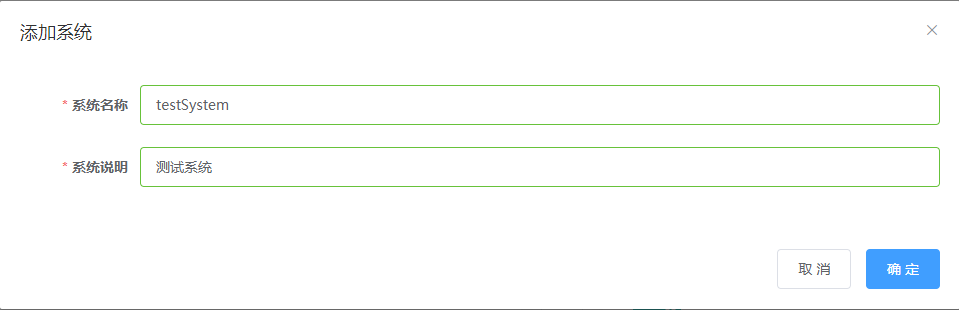
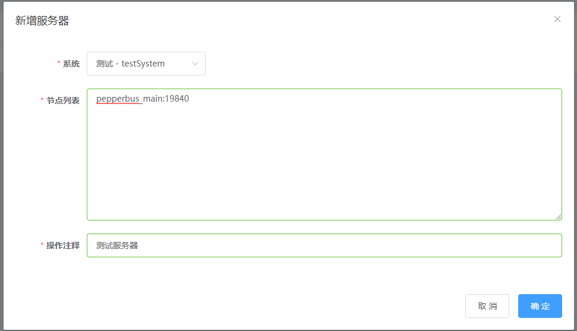
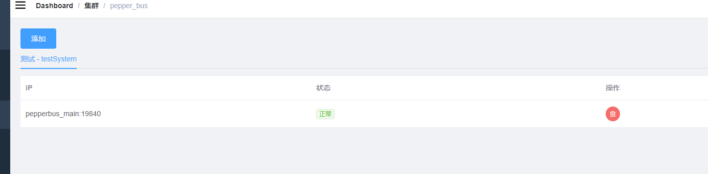
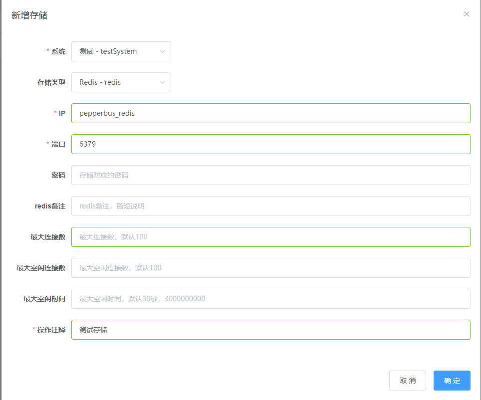
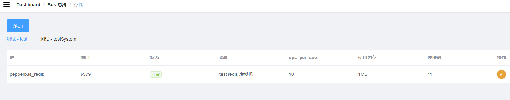
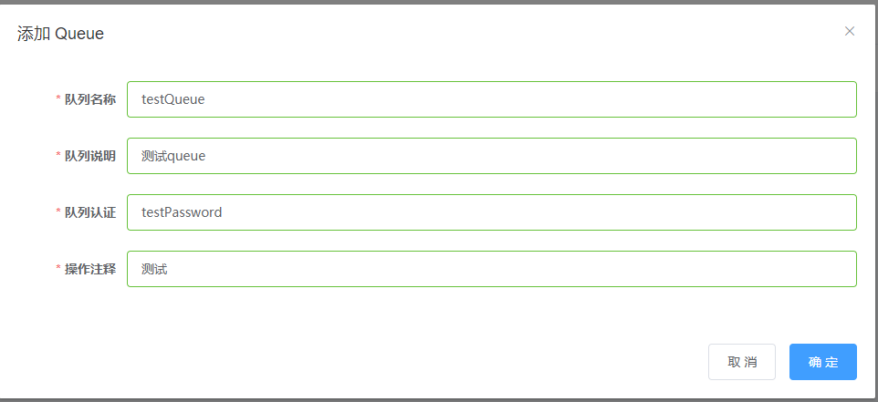
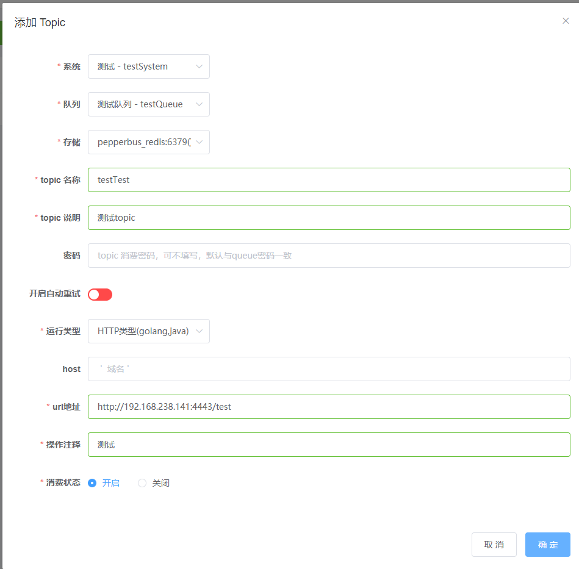
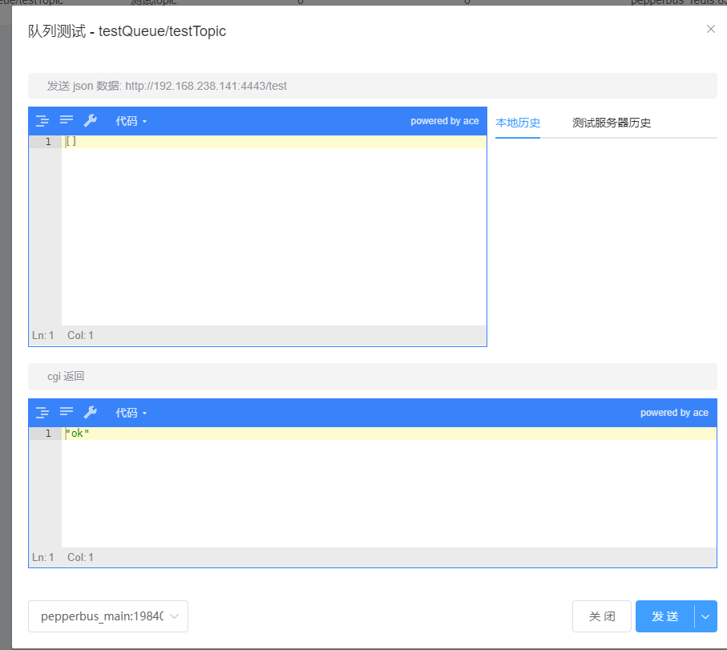
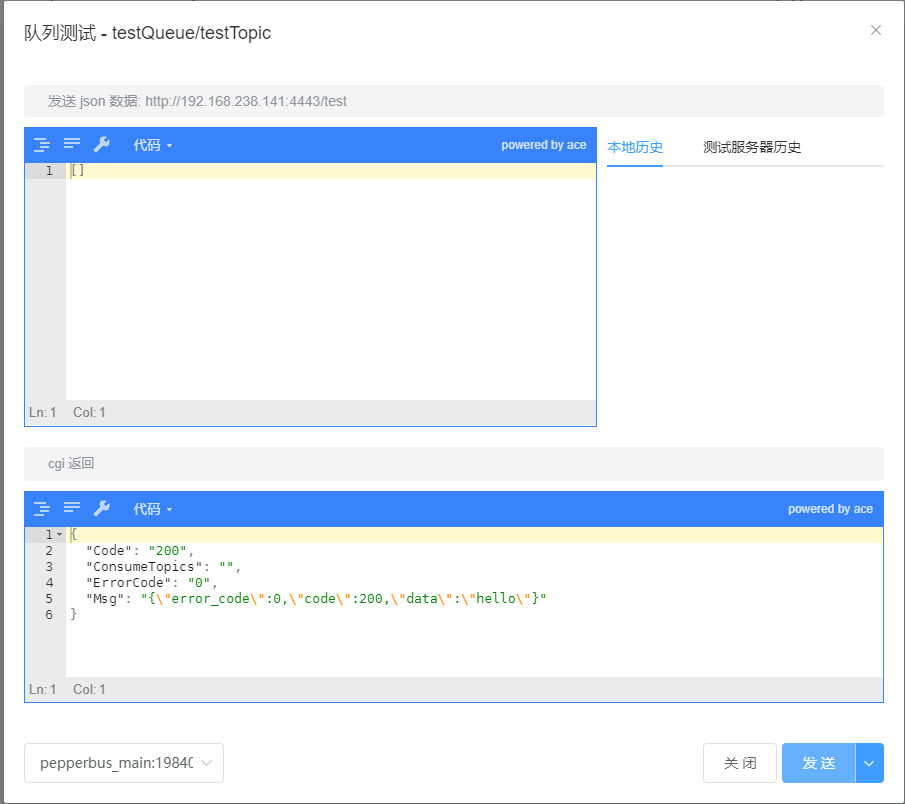

# pepperbus用户使用说明
pepperbus相关配置可以通过修改配置文件完成，但比较繁琐，主要通过dashboard提供的ui界面进行管理，以下为一个完整的使用示例的详细步骤（需要pepperbus服务已经启动）。
## 添加系统

- 首先需要新建一个系统，系统只是根据用户需要而相互之间完全独立，用作标识，系统名称、系统说明可随便填写。
点击 系统-->添加系统：

    

## 添加集群

- 然后需要需要为该系统的集群添加节点，该节点即为运行pepperbus的服务器，可以直接使用pepperbus_main:19840连接默认节点（即为启动pepperbus服务的服务器）。
  点击 集群-->pepper_bus-->添加：

   

    状态呈“正常”即为添加成功：
    
   
    
## 添加存储

- 接下来需要添加存储节点，用于储存job信息，可以直接使用pepperbus_redis:6379。
  点击 Bus总线-->存储-->添加：
    
   

    状态呈“正常”即为添加成功：
    
   
    
    至此pepprebus运行所需服务已配置完成，接下来为一个消费实例。
    
## 添加queue

- queue是用于接收job的队列，各属性可根据需要进行填写.
    点击 Bus总线-->队列-->添加Queue：
    
    

## 添加topic

- topic用于标识queue的子队列，每个topic队列都对应地指定了一个消费文件（可以是php文件，也可以是http），当topic队列接收到job时，pepperbus便会有worker自动执行该消费文件
    点击 Bus总线-->队列-->添加Topic：
    
   

    
示例中指定了一个http类型的消费文件，ip即为pepperbus服务器的ip
> 值得注意的是，由于pepperbus服务运行在docker容器中，此处不能使用127.0.0.1作为ip
    
## 运行http server

- 可使用SDk中封装好的函数运行server，go语言示例：
    ```
    busworker.NewWorkerRouter("/test/").RegisterJobHandler("testQueue","testTopic",testFunc)
    busworker.Serve("192.168.238.141:4443")
    ```
  处理函数定义：
    ```
    func testFunc(r *http.Request) *Resp{
	println("hello world!")
	return &Resp{
		ErrorCode:0,
		Code:200,
                Data:"hello",
	    }
    }
    ```

## 测试

- 在topic页面点击最右侧的测试按钮可即打开测试窗口

    - 发送ping请求，在右下角"发送"按钮的下拉中选择ping:
    
    	
	
        结果为ok表示可以连通
	
    - 测试消费请求，可以在输入框中输入想要测试的json数据，点击发送，即可查看返回结果：
    	
        
	
        结果应与自定义的处理函数返回值保持一致
    
## 发送job

- 使用SDK中相应函数进行job的发送，即可使向队列中添加job，pepperbu会自动检测该服务并进行消费，go语言示例：
    ```
    re := busworker.NewClient("192.168.238.141:12018")
    re.AddJobs("testQueue","test",[]string{"test data1","test data2"})
    ```
    
> [**详细SDK使用说明**](sdk/sdk_instruction.md)

## 查看消费状态

- 点击 Bus总线-->队列-->topic（即为队列列表中“topic”列的按钮），即可查看topic队列的当前状态
    
    
    
    可看到该job已成功消费
    
